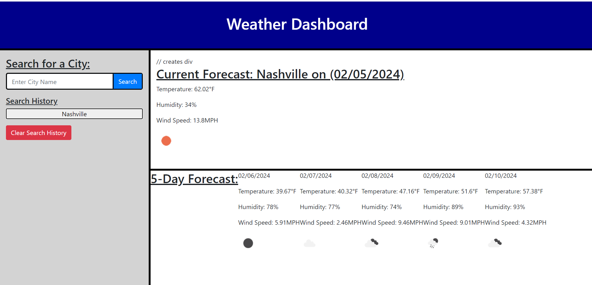

# Weather Dashboard 
This repository contains code that creates a simple weather dashboard. With this dashboard, a user can search a city for the current weather conditions as well as a 5-day forecast. The weather that is displayed is retrieved from the OpenWeatherAPI using the Current Weather Data API and 5-Day/3-Hour Forecast API URLS. 

# Screenshot 

# Link to Deployed App
https://dfussell1.github.io/weather-dashboard/ 